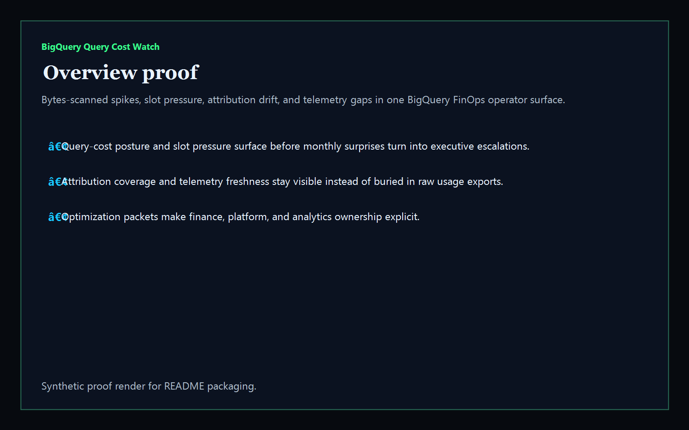
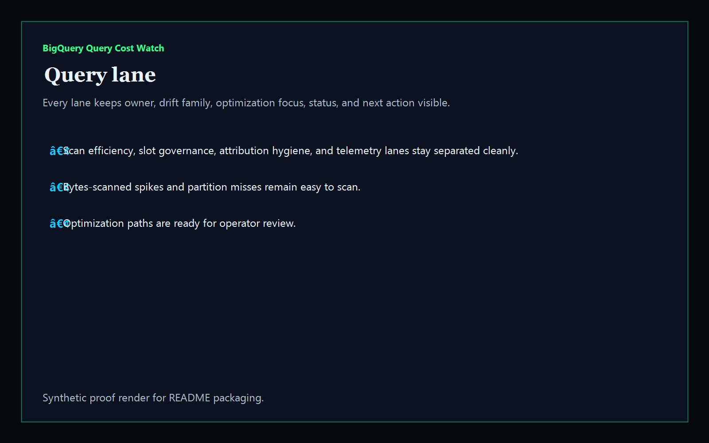
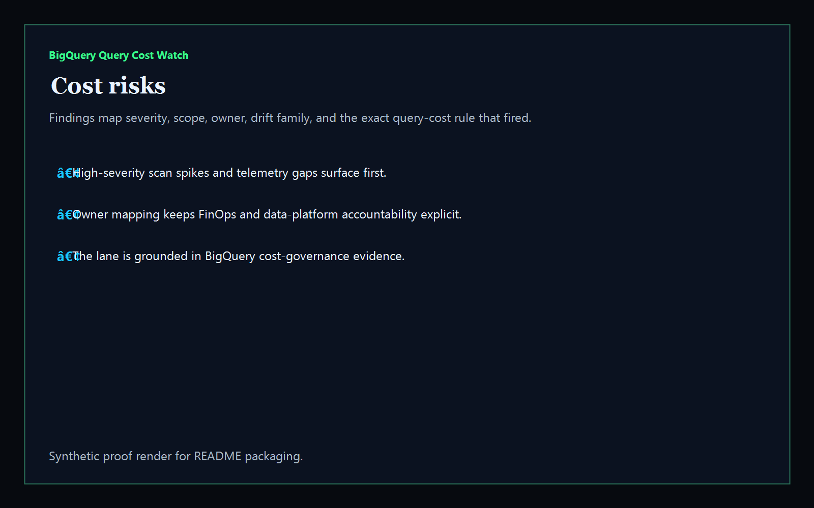
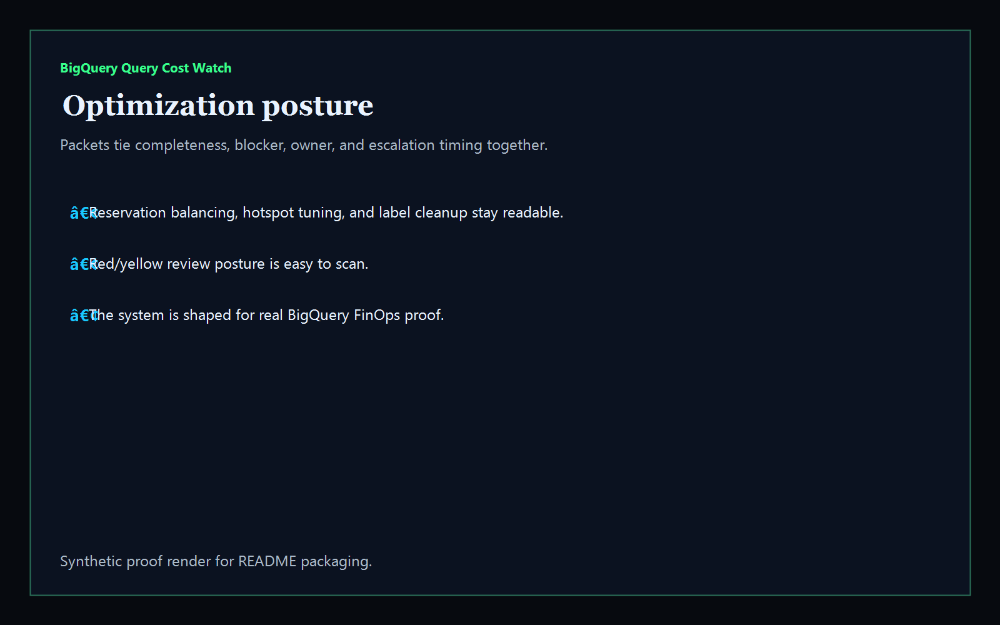

# bigquery-query-cost-watch

[](https://github.com/mizcausevic-dev/bigquery-query-cost-watch/actions/workflows/ci.yml)
[](https://github.com/mizcausevic-dev/bigquery-query-cost-watch/actions/workflows/pages.yml)

Operator control plane for BigQuery query-cost posture, bytes-scanned spikes, slot pressure, attribution drift, telemetry gaps, and optimization sequencing.

## Why this matters

- BigQuery spend gets dangerous when scan spikes, partition misses, slot contention, and unlabeled workloads stay trapped in raw exports instead of one operator-readable surface.
- Recruiters looking for `BigQuery / FinOps / data platform / optimization` proof should see a real operator dashboard, not a keyword page.
- This repo turns BigQuery usage and optimization drift into a control plane for scan containment, reservation hygiene, attribution trust, telemetry continuity, and workload-rightsizing posture.

## Why this matters (KG Embedded tie-back)

This repo demonstrates the query-cost and optimization-control-plane primitive for Kinetic Gain Embedded: workload snapshots, bytes-scanned evidence, attribution hygiene, and remediation packets in one operator surface. Kinetic Gain Embedded extends this pattern into productized in-app dashboards where platform, FinOps, and analytics teams need evidence-rich cost governance without exposing raw admin consoles or live warehouse credentials.

## What it shows

- `query-lane` visibility for scan efficiency, slot governance, attribution hygiene, and telemetry freshness
- `cost-risks` detection for bytes-scanned spikes, partition misses, reservation drift, stale snapshots, and export gaps
- `optimization-posture` packets that tie owner, blocker, timing, and completeness together
- offline-safe analysis of captured BigQuery usage exports
- recruiter-facing BigQuery / FinOps / data-platform proof that complements the Microsoft, AWS, GCP, and reporting lanes

## Routes

- `/`
- `/query-lane`
- `/cost-risks`
- `/optimization-posture`
- `/verification`
- `/docs`

## API

- `/api/dashboard/summary`
- `/api/query-lane`
- `/api/cost-risks`
- `/api/optimization-posture`
- `/api/verification`
- `/api/sample`

## Screenshots






## CLI

```powershell
npx bigquery-query-cost-watch fixtures/bigquery-query-hotspots.json `
  --format markdown `
  --fail-on-high
```

## Validation

- `npm run verify`
- `npm run prerender`
- `npm run render:assets`

## Local development

```powershell
cd bigquery-query-cost-watch
npm install
npm run dev
```

Then open:

- [http://127.0.0.1:5524/](http://127.0.0.1:5524/)
- [http://127.0.0.1:5524/query-lane](http://127.0.0.1:5524/query-lane)
- [http://127.0.0.1:5524/cost-risks](http://127.0.0.1:5524/cost-risks)
- [http://127.0.0.1:5524/optimization-posture](http://127.0.0.1:5524/optimization-posture)

## Packaging

| Item | Value |
|---|---|
| License | `AGPL-3.0-or-later` |
| CNAME | `bigquery.kineticgain.com` |
| Live site | [https://bigquery.kineticgain.com/](https://bigquery.kineticgain.com/) |
| Deploy | Static prerender -> GitHub Pages |

## Docs

- [docs/KINETIC_GAIN_EMBEDDED.md](./docs/KINETIC_GAIN_EMBEDDED.md)

## Related

- [**`gcp-billing-anomaly-router`**](https://github.com/mizcausevic-dev/gcp-billing-anomaly-router) — GCP cost anomaly routing lane
- [**`regulatory-reporting-mart`**](https://github.com/mizcausevic-dev/regulatory-reporting-mart) — reporting and warehouse proof
- [**`snowflake-cost-governance-studio`**](https://github.com/mizcausevic-dev/snowflake-cost-governance-studio) — warehouse cost governance on Snowflake
